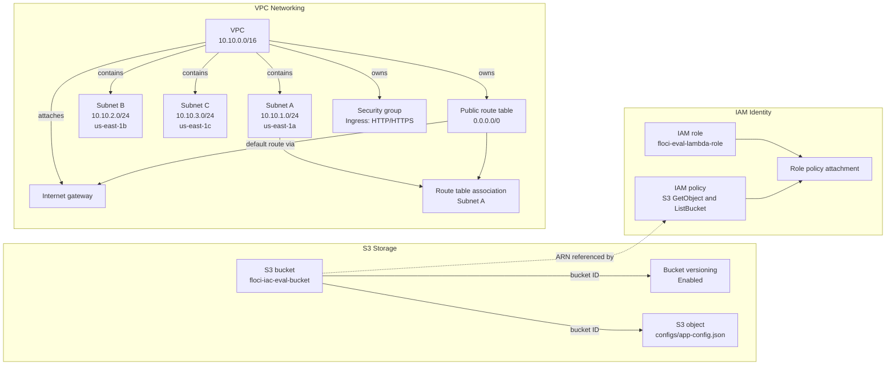

```mermaid
flowchart LR
	subgraph S3["S3 Storage"]
		Bucket["S3 bucket<br/>floci-iac-eval-bucket"]
		Versioning["Bucket versioning<br/>Enabled"]
		Object["S3 object<br/>configs/app-config.json"]
		Bucket -->|bucket ID| Versioning
		Bucket -->|bucket ID| Object
	end

	subgraph VPC["VPC Networking"]
		Network["VPC<br/>10.10.0.0/16"]
		SubnetA["Subnet A<br/>10.10.1.0/24<br/>us-east-1a"]
		SubnetB["Subnet B<br/>10.10.2.0/24<br/>us-east-1b"]
		SubnetC["Subnet C<br/>10.10.3.0/24<br/>us-east-1c"]
		Gateway["Internet gateway"]
		RouteTable["Public route table<br/>0.0.0.0/0"]
		Association["Route table association<br/>Subnet A"]
		SecurityGroup["Security group<br/>Ingress: HTTP/HTTPS"]

		Network -->|contains| SubnetA
		Network -->|contains| SubnetB
		Network -->|contains| SubnetC
		Network -->|attaches| Gateway
		Network -->|owns| RouteTable
		RouteTable -->|default route via| Gateway
		SubnetA --> Association
		RouteTable --> Association
		Network -->|owns| SecurityGroup
	end

	subgraph IAM["IAM Identity"]
		Role["IAM role<br/>floci-eval-lambda-role"]
		Policy["IAM policy<br/>S3 GetObject and ListBucket"]
		Attachment["Role policy attachment"]
		Role --> Attachment
		Policy --> Attachment
	end

	Bucket -.->|ARN referenced by| Policy
```
